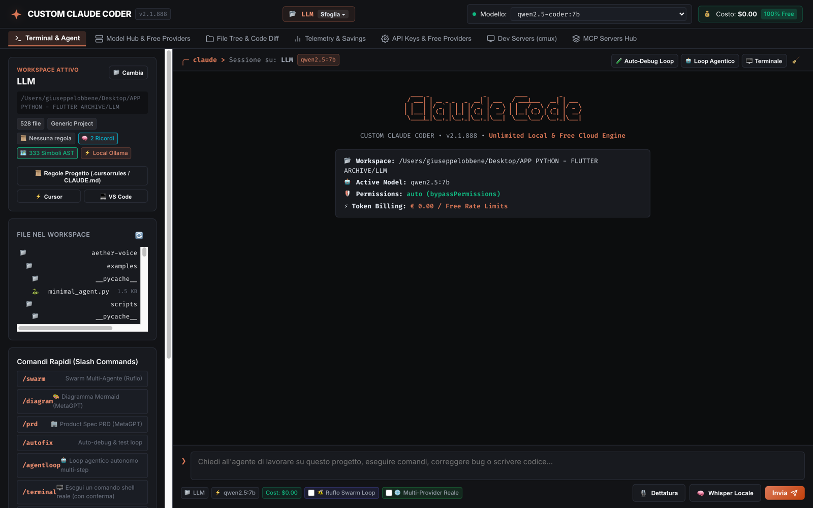
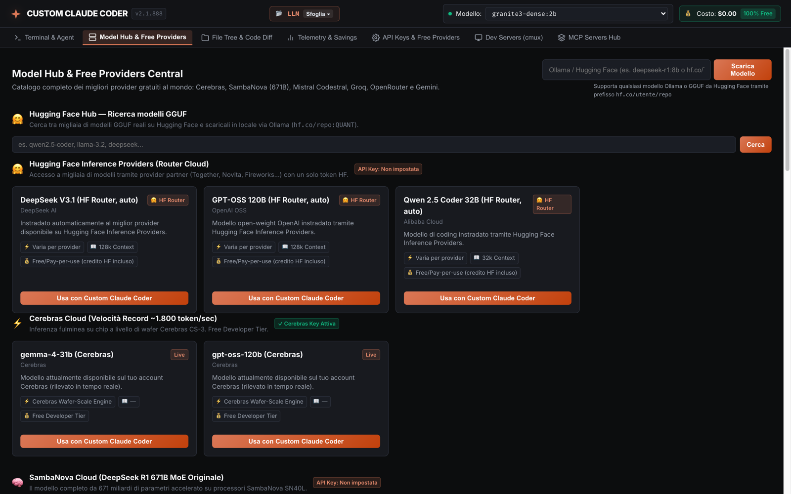
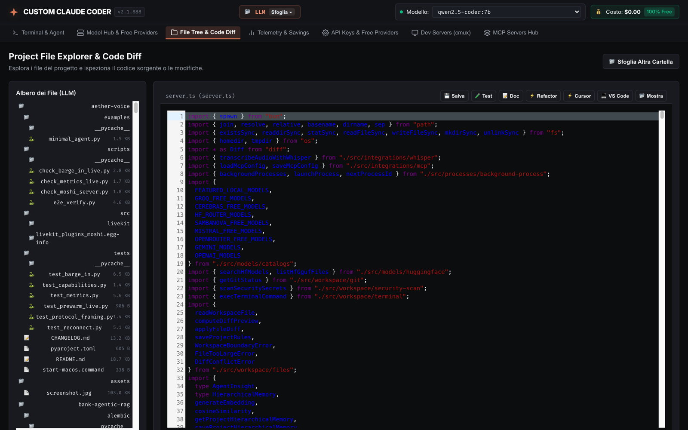
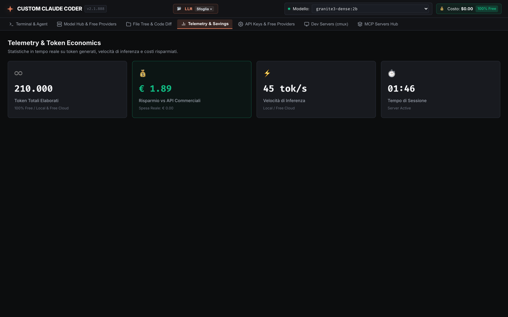
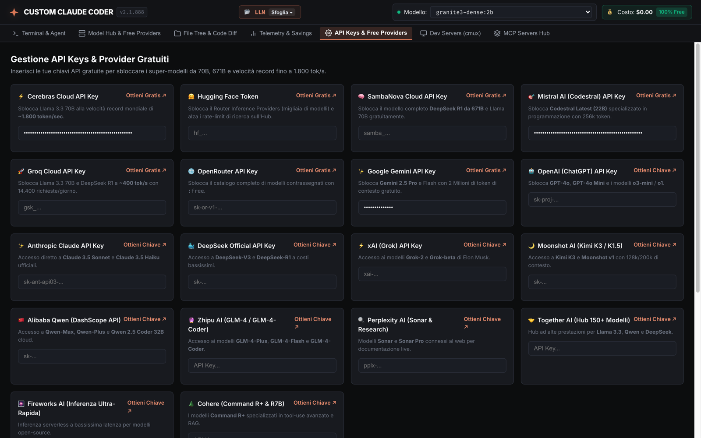
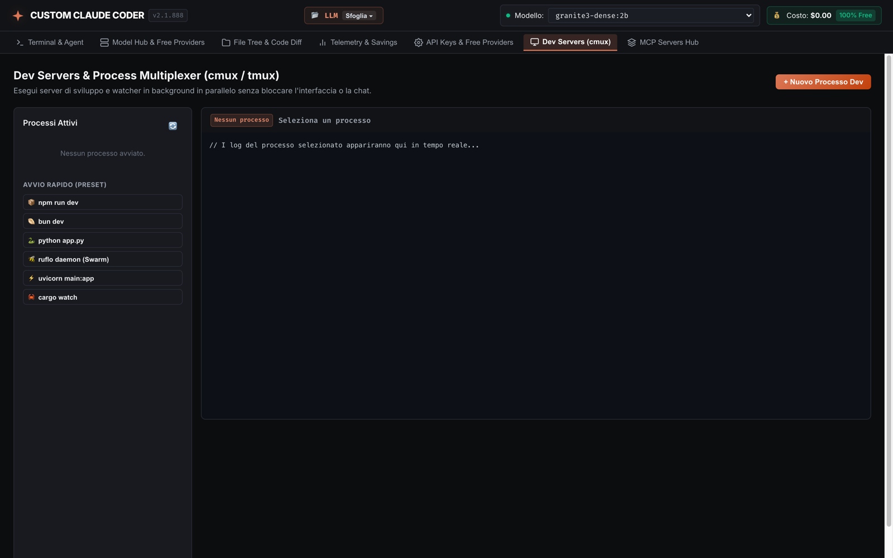
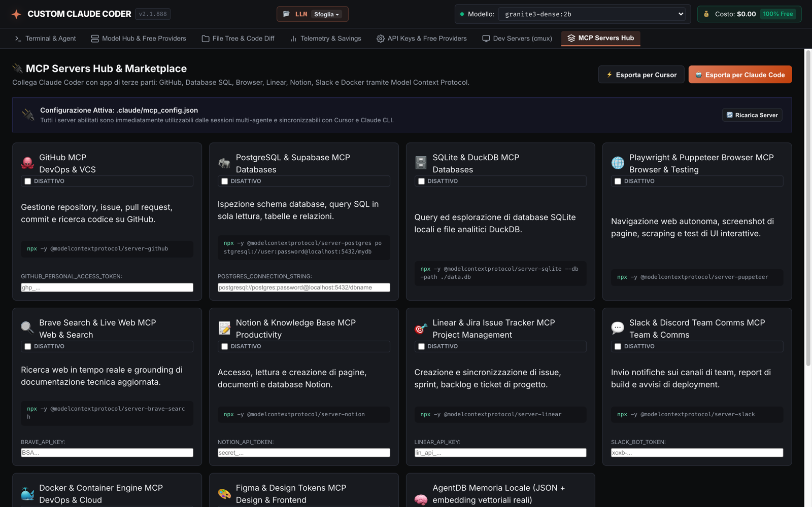
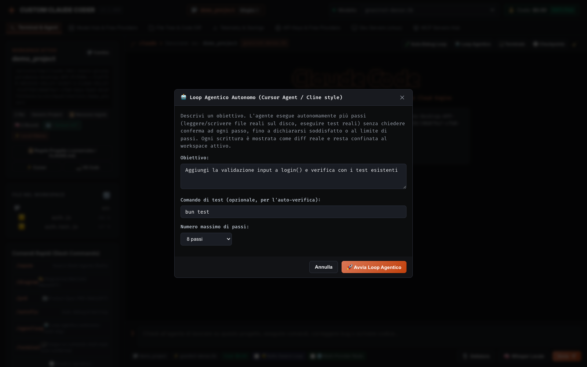
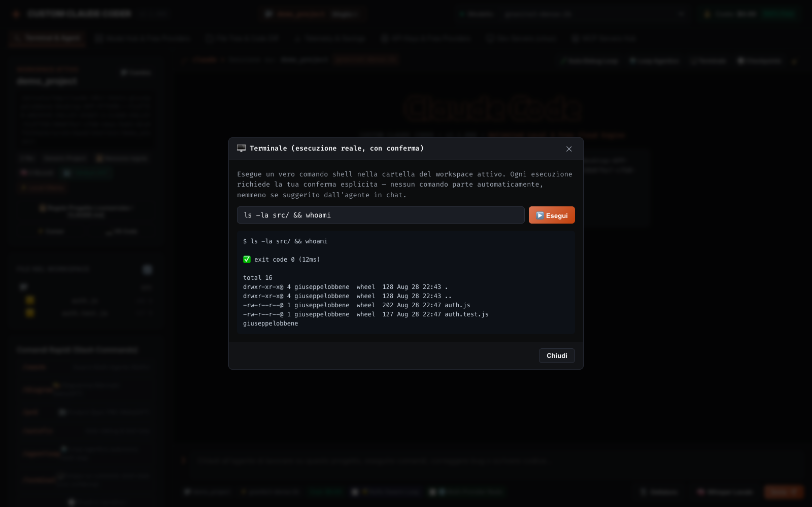
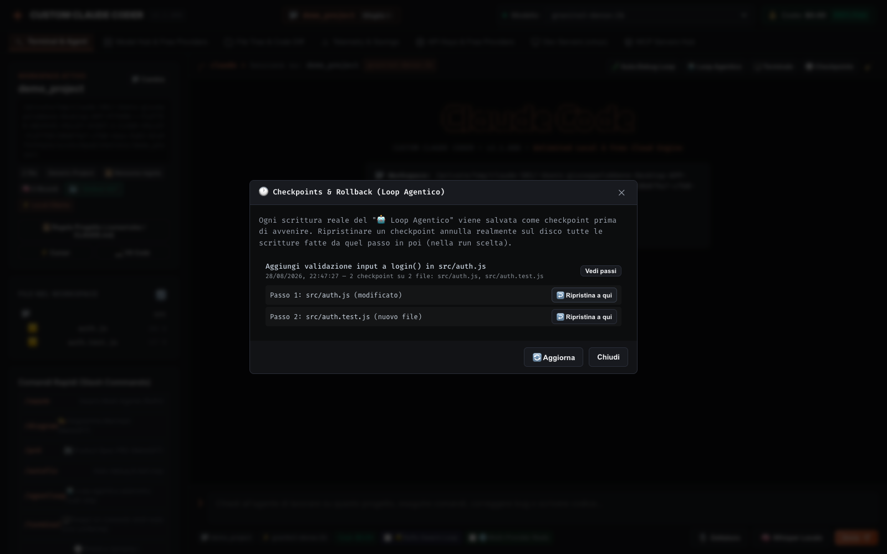

# ⚡ Claude Local Studio

[](https://bun.sh/)
[](https://www.typescriptlang.org/)
[](LICENSE)
[](#-universal-model-support)

[English 🇬🇧](#english) • [Italiano 🇮🇹](#italiano)

> **The universal, privacy-first Web Studio & Dev Server for Claude Code, a sequential 3-role agent pipeline (Ruflo-style, with a real multi-provider mode), a real multi-language AST repo symbol map (TypeScript Compiler API + tree-sitter for Python/Rust/Go/Java/C/C++, Aider-style, with regex fallback only for the rest), Visual Architecture Diagrams (MetaGPT), and 20+ Local & Cloud AI Providers.**
> *L'interfaccia Web & Server di sviluppo universale per Claude Code, una pipeline sequenziale a 3 ruoli (stile Ruflo, con una modalità multi-provider reale), una mappa dei simboli con AST reale multi-linguaggio (TypeScript Compiler API + tree-sitter per Python/Rust/Go/Java/C/C++, stile Aider, con fallback a regex solo per il resto), MetaGPT e 20+ Provider di Intelligenza Artificiale.*



### 🖼️ Screenshots (real UI, captured live from a running instance)

| | |
|---|---|
| **Terminal & Agent** — chat principale, workspace attivo, comandi rapidi | **Model Hub & Free Providers** — ricerca Hugging Face, catalogo Cerebras/HF Router |
|  |  |
| **File Tree & Code Diff** — esplora e visualizza il codice sorgente reale | **Telemetry & Savings** — token elaborati, risparmio stimato, velocità |
|  |  |
| **API Keys & Free Providers** — gestione centralizzata di 16+ chiavi | **Dev Servers (cmux)** — multiplexer processi di sviluppo in background |
|  |  |
| **MCP Servers Hub** — marketplace Model Context Protocol (GitHub, DB, browser, Slack...) | **🤖 Loop Agentico Autonomo** — read_file/write_file/run_test multi-step, stile Cursor Agent/Cline |
|  |  |
| **🖥️ Terminale reale** — esecuzione shell con conferma esplicita, output reale (`exit code`, `stdout`) | **🕐 Checkpoints & Rollback** — cronologia reale delle scritture del Loop Agentico, ripristino passo-per-passo |
|  |  |

---

<a name="english"></a>
## 🇬🇧 English Documentation

### 🌟 Key Features & Competitive Advantages

#### 1. 🤖 100% Universal Model Support (Zero Costs & Complete Privacy)
* **Local Offline**: Native support for **Ollama**, **GGUF**, **Apple MLX**, **vLLM**, **LM Studio**, **Mozilla Llamafile**, **AirLLM** (run 70B models on 4GB VRAM via NVMe layer streaming), and **[LocalAI](https://github.com/mudler/LocalAI)** (`localai/<model>`, probed live like every other local engine — reaches LocalAI's own 60+ inference backends behind one OpenAI-compatible endpoint, `LOCALAI_HOST` env var to override the default `http://localhost:8080`).
* **Real bug found and fixed while wiring the LocalAI route**: `handleOpenAICompatibleStream` (`src/providers/openai-compat.ts`) had no `try/catch` around its outgoing `fetch` — any unreachable local engine (LocalAI not running, or any of the other local routes above) crashed the request with Bun's raw HTML dev-error page instead of an honest JSON error. Fixed for all local *and* cloud routes at once (they all go through this one function), verified live both ways: `localai/<model>` with no LocalAI instance running now returns a clean `{"error":{"type":"connection_error","message":"..."}}`, and the pre-existing Ollama path was re-tested afterwards to confirm it still streams a real response unaffected.
* Honesty note on scope: this closes the *reach* gap toward [LocalAI](https://github.com/mudler/LocalAI) (one more backend behind one more OpenAI-compatible route), not a merge. `airllm_server.py` and `whisper-models/` in this same repo cover ground LocalAI also covers natively (layer-streamed inference, Whisper STT) — they're left in place, not removed, since retiring working code the moment an alternative *could* replace it is a separate, larger decision this change doesn't make on its own.
* **Ultra-Fast Cloud Free Tiers**: Built-in support for **Cerebras (1,800+ tok/s)**, **Groq LPU (350+ tok/s)**, **SambaNova**, **Mistral Codestral (256k context)**, **Google Gemini 2.5 Pro (1M-2M context)**, **DeepSeek V3 / R1**, **OpenAI (GPT-4o, o3-mini)**, **xAI Grok**, **Moonshot Kimi**, **Alibaba Qwen**, **Zhipu GLM**, **Perplexity Sonar**, and **OpenRouter**.

#### 2. 🐝 Sequential 3-Role Agent Pipeline (Ruflo / Ralph Loop)
* `/swarm` (or the "Ruflo Swarm Loop" checkbox) runs 3 **sequential** calls to the same active model, each with a different role system-prompt: **System Architect** $\rightarrow$ **Core Coder** $\rightarrow$ **Reviewer**. Each phase's output is auto-saved as a text insight in `AgentDB` (a local JSON file, see below).
* Honesty note (single-model mode): this is a single-model prompt-chaining pipeline, not a multi-model swarm. There is no real voting/consensus algorithm between independent models, and the "Reviewer" phase does not automatically block or grade the output — its critique is plain text you have to read yourself.
* **🌐 Multi-Provider Reale (real gap now closed)**: checking the "Multi-Provider Reale" box alongside Swarm mode routes the 3 roles to **actually different cloud providers** (reusing the same provider infrastructure as the Ensemble comparison below) — e.g. Architect on Groq, Coder on Cerebras, Reviewer on Mistral — instead of 3 calls to the same model. It requires at least 2 configured cloud provider API keys; with fewer than 3 it honestly discloses which role reused a provider instead of silently faking distinctness. The Reviewer phase in this mode is also asked for a strict JSON verdict block (`{"verdict": "PASS"|"FAIL", "score": 0-10, "issues": [...]}`), which the server **actually parses** and shows as a real ✅/❌ badge — if the model doesn't return valid JSON, the UI says so explicitly ("verdetto non strutturato") rather than showing a fake badge.

#### 3. 🗺️ Real Multi-Language AST Repo Map & Context Mentions (Aider & Continue style)
* For **TypeScript / JavaScript / TSX / JSX / MJS / CJS**, the repo map is built with the real **TypeScript Compiler API** (`ts.createSourceFile` + AST traversal, the same parser `tsc` itself uses) — not a text/regex scan. It correctly ignores strings, comments, and symbol-shaped text inside template literals, and extracts genuine `FunctionDeclaration`, `ClassDeclaration` (with methods/properties), `InterfaceDeclaration`, `TypeAliasDeclaration`, `EnumDeclaration`, and exported `const` arrow-function signatures straight from the parsed nodes. Each entry in the map is tagged `🌳 AST`.
* **For Python / Rust / Go / Java / C / C++** (gap closed, was previously regex-only): the repo map is now built with a real **tree-sitter** parser (`web-tree-sitter` + prebuilt WASM grammars from `tree-sitter-wasms`, loaded once at server startup), walking the genuine syntax tree per language (`function_definition`/`class_definition` for Python, `function_item`/`struct_item`/`impl_item`/`trait_item` for Rust, `function_declaration`/`method_declaration`/`type_declaration` for Go, `method_declaration`/`class_declaration`/`interface_declaration` for Java, `function_definition`/`struct_specifier`/`class_specifier` for C/C++), correctly grouping methods under their class/impl/struct. Tagged `🌳 tree-sitter AST` in the output. Verified live against real third-party source (170 real symbols from 39 real Python files in this repo's own sibling project DEEVX99-LD; 36 real symbols from 8 real Rust files in claude-coder-tauri, including nested `impl` methods).
* **Dart/Flutter** is a known, disclosed exception: its tree-sitter WASM grammar in the bundled package was compiled against a newer ABI (language version 15) than any currently available `web-tree-sitter` runtime supports (compatibility range 13–14), so loading fails at startup and Dart files honestly fall back to the regex heuristic below rather than silently breaking.
* For any language without a working grammar (currently only Dart, or any language not in the list above), the map falls back to a lightweight line-by-line **regex** heuristic scanner, explicitly tagged `🔤 regex-fallback` in the output, so it's always clear which files were structurally parsed and which were pattern-matched. Multi-line signatures, nested scopes, and non-trivial syntax can still be missed or mis-parsed in the regex-fallback files.
* Support for contextual prompt mentions: `@file:<path>`, `@git`, `@diff`.
* **`@codebase(<query>)` — real semantic codebase search (new, a genuine gap vs Cursor/Cline/Continue's `@codebase`)**: unlike `@file` (which needs an exact path) or a keyword search, this finds the *most relevant* real code chunks for a natural-language query using the same real embedding infrastructure built for AgentDB memory (Ollama `nomic-embed-text` when available, deterministic hash fallback otherwise). The workspace is split into real ~40-line chunks per source file, each with a real embedding, indexed once and cached to `.claude/codebase-index.json` (incrementally updated by file `mtime`, so unchanged files are never re-embedded — a warm re-run over this repo's own ~180 chunks completed in 32ms vs. ~18s cold). The top-5 chunks by real cosine similarity are injected into the prompt with their file/line and score. Verified live against this repo's own source: a query for *"trascrizione audio con whisper"* (transcribing audio with whisper) correctly surfaced the real Whisper dictation code in `public/app.js` and `server.ts` above every other file, and *"swarm multi provider verdetto JSON"* correctly surfaced the real swarm verdict-parsing code — neither query used the exact identifier names in the code, confirming genuine semantic (not keyword) matching.

#### 4. 🎨 Visual Architecture Diagrams & PRD Engine (MetaGPT / Mermaid.js)
* Live rendering of interactive color diagrams (flowcharts, sequence diagrams, class models, ER graphs) directly in the console with `/diagram`.
* Generates structured Product Requirement Documents (PRDs) with `/prd`.

#### 5. 🎙️ Hands-Free Voice-to-Code — Browser Speech API **and** real local Whisper (gap closed)
* **"Dettatura" button**: real-time voice dictation using the browser's native `SpeechRecognition` API (Chrome/Edge). No Whisper model involved here — accuracy and language support depend on the browser.
* **"Whisper Locale" button (new, genuinely real)**: records audio with the browser's `MediaRecorder`, uploads it to a new `/api/voice/transcribe` endpoint, which converts it to 16kHz mono WAV via `ffmpeg` and transcribes it with a real, locally-running **[whisper.cpp](https://github.com/ggml-org/whisper.cpp)** process (`whisper-cli`) using an actual GGML model — not a stub, not a browser API pass-through. Requires two things this repo does **not** bundle (by design, they're too large/binary for a source repo): `brew install whisper-cpp`, and a GGML model downloaded into `whisper-models/` (see setup below). If either is missing, or `ffmpeg` isn't installed, the endpoint returns a clear, actionable error instead of silently falling back to the browser engine or faking a transcript.
* **Setup** (macOS, one-time):
  ```bash
  brew install whisper-cpp ffmpeg
  mkdir -p whisper-models
  curl -L -o whisper-models/ggml-base.bin https://huggingface.co/ggerganov/whisper.cpp/resolve/main/ggml-base.bin
  ```
* Verified end-to-end with real audio (a synthesized Italian sentence via macOS `say`, converted to webm/opus exactly as a browser `MediaRecorder` would produce): the full pipeline (upload → ffmpeg conversion → whisper.cpp transcription → JSON parse) correctly returned the real transcript.

#### 6. 🧠 3-Tier Hierarchical Memory (JSON file + real vector embeddings, gap closed)
* **Tier 1 (Working Scratchpad)**: immediate task status and focus.
* **Tier 2 (Episodic Memories)**: recent session actions, decisions, and command outputs.
* **Tier 3 (Archival Base)**: persistent architectural conventions and developer preferences.
* Storage is a plain JSON file per project (`.claude/agentdb.json`), but every saved insight now carries a **real vector embedding**: if Ollama exposes `nomic-embed-text` it's used (`/api/embeddings`, native 768-dim vectors), otherwise a deterministic hash-based embedding (trigram + subword, 384-dim) is computed as a fallback — never `Math.random()`. Retrieval used in prompts no longer just returns "most recent N entries": it computes **real cosine similarity** between the current request's embedding and every saved memory's embedding, surfacing the most relevant ones even if they aren't the most recent. Pre-existing memories without an embedding get one computed and persisted lazily on first use. Note: because the real (768-dim) and fallback (384-dim) paths produce different-length vectors, a similarity comparison between one memory embedded via Ollama and another embedded via the fallback safely scores 0 (dimension mismatch guard) rather than crashing or producing a meaningless number — this can happen if Ollama was temporarily unreachable when only some memories were saved.

#### 7. ⚡ Background Dev Server Multiplexer (`cmux`)
* Run and monitor multiple background dev processes in parallel (`npm run dev`, `bun server.ts`, `python app.py`, `airllm`, `exo`) with real-time log streaming.

#### 8. 📱 Mobile Remote Bridge (Telegram Bot)
* Control your coding workspace remotely from your smartphone using a secure, firewall-bypassing Telegram long-polling bot.

#### 9. 🔀 Real Unified-Diff Preview & Apply, and a Real Multi-Provider Ensemble
* `/api/workspace/file/diff-preview` computes a genuine unified diff (Myers algorithm, via the `diff` npm package) between a file's on-disk content and LLM-proposed new content — preview-only, nothing is written. `/api/workspace/file/diff-apply` writes it for real, with an optional optimistic-concurrency check (`expectedOldContent`) so a file that changed on disk since the preview isn't silently clobbered.
* `/api/agent/ensemble` sends the same prompt to 2+ **different** configured cloud providers/models in parallel (Anthropic, OpenAI, Groq, Cerebras, Mistral, Gemini, OpenRouter) and returns each one's raw, unmodified response. Unlike the 3-role pipeline above, this is a real cross-provider comparison — no voting, no merged "consensus" answer.

#### 10. 🤖 Autonomous Multi-Step Agentic Loop (new — a genuine gap vs Cursor Agent / Cline)
* `/agentloop` (or the "🤖 Loop Agentico" button) is a **real** multi-step autonomous loop: give it a goal and it repeatedly decides and executes one real action per step — `read_file`, `write_file`, `run_test`, or `done` — without a prompt per step, exactly the capability Cursor Agent and Cline have that this project lacked before.
* Each step is a single non-streaming LLM call (`POST /v1/messages` with `stream:false`) that must return one JSON action object; `write_file` always writes the **complete real file content to disk** (verified with `writeFileSync`, not a diff/patch the model has to apply itself), shown to you as a real unified diff (`Diff.createTwoFilesPatch`) as it happens. `run_test` really executes the given test command (`Bun.spawn`, same real subprocess pattern as `/autofix`) and feeds the real exit code and output back into the next step.
* **Safety guardrails, all real and tested**: every `read_file`/`write_file` path is resolved and must stay inside the active workspace — a `../` escape attempt is rejected and logged, verified live (`../evil.txt` correctly blocked while a legitimate in-workspace `evil.txt` was allowed, as expected). Writes are capped at 20 files per run. If the model fails to return valid JSON for 2 consecutive steps, the loop stops honestly instead of spinning. It never runs `git commit`/`git push` itself — that stays a separate, explicit action (`/commit`).
* Verified end-to-end on a real fixture project (a failing `node` test expecting an `add(a,b)` function that didn't exist yet): the loop wrote the missing function to the real file, ran the real test command, saw a real `exit code 0`, and correctly declared itself done — independently re-run afterward to confirm the fix was genuinely on disk and the test genuinely passed.

#### 11. 🖥️ Real Terminal Command Execution, always with explicit confirmation (new)
* `/terminal` (or the "🖥️ Terminale" button) opens a real shell into the active workspace: `POST /api/workspace/terminal/exec` runs the given command for real via `Bun.spawn` and returns the real exit code, stdout and stderr. Every execution requires you to click "▶️ Esegui" yourself — there is no auto-run path anywhere in this feature.
* After a normal chat response finishes streaming, the client scans the completed text for short ```bash/```sh/```shell fenced code blocks the model suggested and adds a real, clickable "▶️ Esegui" button next to each one (skipped for anything longer than 5 lines, to avoid offering to "run" a whole script blindly). Clicking it opens a native `confirm()` dialog showing the exact command before it reaches the terminal endpoint — closing the loop on "the agent can propose a command during the conversation, but only runs it with your confirmation," the way Cursor/Cline/Aider's terminal tool works.
* Verified live in the browser: a real `echo ... && whoami` typed into the Terminal panel returned the real exit code and real output (including the actual macOS username); a synthetic assistant response containing a ` ```bash\nnpm install lodash\n``` ` block was correctly detected and rendered as a real, clickable suggestion.

#### 12. 🕐 Checkpoints & Rollback for the Agentic Loop (new — closes a real Cline gap)
* Cline snapshots the workspace before every agent action and lets you roll the whole workspace back to any point in the session — the `/agentloop` above showed a real diff for every write but had no way to undo one. `src/agent/checkpoints.ts` closes that: every real `write_file` inside a loop run is preceded by a real checkpoint, persisted immediately to `<workspace>/.claude/checkpoints/<runId>.json` (survives a dropped connection or crash mid-loop, not just an in-memory list).
* `/checkpoints` (or the "🕐 Checkpoints" button) lists real past runs for the active workspace, lets you expand any run to see its real per-step writes, and restore to any step: `POST /api/agent/checkpoints/restore` reverts every file touched from that step onward to its exact pre-write content — or deletes it, if that step had created the file from nothing. This is real file I/O (`writeFileSync`/`unlinkSync`), not a simulated undo.
* Verified with a real fixture (no LLM involved, isolating the rollback logic itself): 3 real writes across 2 files (a modify, a new file, a second modify to the same file) were checkpointed and then correctly rolled back — the modified file returned to its exact original content and the newly-created file was deleted — confirmed both by calling the module directly and via the live HTTP endpoint (with the real local auth token), including confirming the auth gate rejects the same request with no token (`401`).
* A real bug was found and fixed while building this feature's screenshot: a duplicated CSS `display` property in the generated checkpoint-step list HTML made the list start in an already-"open" state, so the very first click on "Vedi passi" immediately closed (and never populated) it. Caught by trying to screenshot the expanded state and seeing an empty panel — fixed and re-verified with a screenshot showing the real expanded steps and restore buttons.

### 🗂️ The 7 Studio Tabs

| Tab | What it actually does |
| :--- | :--- |
| **Terminal & Agent** | Main chat with the active model, workspace file tree, active-project stats (file count, project rules, AST symbol count), quick slash-command shortcuts, one-click links to open the workspace in Cursor/VS Code. |
| **Model Hub & Free Providers** | Hugging Face GGUF search + one-click `ollama pull hf.co/...`, live-detected Cerebras/HF-Router model catalogs (only shows models actually available on your account), and every other free-tier provider card. |
| **File Tree & Code Diff** | Read-only source browser with real syntax highlighting for the attached workspace; per-file actions (Test/Doc/Refactor generation, open in Cursor/VS Code). |
| **Telemetry & Savings** | Live counters: total tokens processed this session, estimated € saved vs. commercial APIs, real inference tok/s, session uptime. |
| **API Keys & Free Providers** | Centralized form for all 16+ provider API keys (Cerebras, HF, SambaNova, Mistral, Groq, OpenRouter, Gemini, OpenAI, Anthropic, DeepSeek, xAI, Kimi, Qwen, GLM, Perplexity, Together, Fireworks, Cohere), each with a direct "get a free key" link and live status badge. |
| **Dev Servers (cmux)** | Background process multiplexer: launch and stream logs from multiple dev servers (`npm run dev`, `bun dev`, `python app.py`, the Ruflo daemon, etc.) without blocking the chat. |
| **MCP Servers Hub** | Model Context Protocol marketplace: toggle and configure GitHub, PostgreSQL/Supabase, SQLite/DuckDB, Playwright/Puppeteer, Brave Search, Notion, Linear/Jira, Slack/Discord, Docker, Figma and local AgentDB memory servers, exportable straight to Cursor's or Claude Code's own MCP config. |

### 🚀 The 20 Specialized Slash Commands

| Slash Command | Role & Specialization |
| :--- | :--- |
| **`/swarm <task>`** | Runs the autonomous 3-agent swarm pipeline (Ruflo) |
| **`/agentloop <goal>`** | Autonomous multi-step loop: reads/writes real files and runs real tests without a prompt per step |
| **`/terminal`** | Opens a real terminal in the workspace, always requires explicit confirmation before running |
| **`/checkpoints`** | Review and roll back real per-file checkpoints saved by the agentic loop |
| **`/diagram <task>`** | Generates visual Mermaid.js architectural diagrams |
| **`/prd <feature>`** | Creates a comprehensive Product Requirement Document |
| **`/autofix`** | Autonomous test-and-repair loop on real stack traces |
| **`/review`** | Deep security audit, latent bug detection, and code smell analysis |
| **`/refactor`** | Clean SOLID refactoring and modular optimization |
| **`/test`** | Generates complete, isolated unit and integration test suites |
| **`/bench`** | Computational complexity ($O(n)$) and bottleneck profiling |
| **`/commit`** | Auto-generates conventional semantic Git commits from diffs |
| **`/secscan`** | Scans workspace for leaked API tokens and private keys |
| **`/docker`** | Generates multi-stage production Dockerfiles and docker-compose |
| **`/ci`** | Generates automated GitHub Actions CI/CD workflows |
| **`/env`** | Creates a fully documented `.env.example` file |
| **`/explain`** | Step-by-step logic and architectural onboarding walkthrough |
| **`/doc`** | Generates README files, API docs, and JSDoc/Docstrings |
| **`/clear`** | Clears the terminal console display |
| **`/help`** | Displays the interactive command guide |

### 🛠️ Quick Start
```bash
git clone https://github.com/lobbenedesign/claude-local-studio.git
cd claude-local-studio
bun install
bun server.ts
```
Open the URL printed in the console (`http://localhost:3001/?token=...`) — the token is required on first visit, then a local cookie remembers you.

**macOS app bundle** (no terminal, no Bun install needed for end users):
```bash
bun run package:macos
```
Produces `dist/Claude Local Studio.app` and `dist/Claude-Local-Studio-<version>.dmg` — double-click to run, the launcher opens your default browser on the already-authenticated URL.

---

<a name="italiano"></a>
## 🇮🇹 Documentazione in Italiano

### 🌟 Caratteristiche Principali

#### 1. 🤖 100% Universale (Zero Costi & Privacy Totale)
* **Offline Locale**: Supporto per **Ollama**, **GGUF**, **Apple MLX**, **vLLM**, **LM Studio**, **Mozilla Llamafile**, **AirLLM** (modelli da 70B su GPU da 4GB via streaming NVMe) e **[LocalAI](https://github.com/mudler/LocalAI)** (`localai/<modello>`, rilevato dal vivo come ogni altro motore locale — raggiunge i 60+ backend di inferenza di LocalAI dietro un unico endpoint OpenAI-compatibile, variabile `LOCALAI_HOST` per cambiare il default `http://localhost:8080`).
* **Bug reale trovato e corretto cablando la route LocalAI**: `handleOpenAICompatibleStream` (`src/providers/openai-compat.ts`) non aveva un `try/catch` attorno al `fetch` in uscita — qualunque motore locale irraggiungibile (LocalAI non avviato, o una qualsiasi delle altre route locali sopra) mandava in crash la richiesta con la pagina HTML grezza di errore di Bun invece di un errore JSON onesto. Corretto per tutte le route locali *e* cloud insieme (passano tutte da questa stessa funzione), verificato dal vivo in entrambi i casi: `localai/<modello>` senza LocalAI in esecuzione ora restituisce un pulito `{"error":{"type":"connection_error","message":"..."}}`, e il percorso Ollama preesistente è stato riverificato subito dopo per confermare che continua a rispondere realmente senza regressioni.
* Nota di onestà sullo scope: questo colma il divario di *copertura* verso [LocalAI](https://github.com/mudler/LocalAI) (un backend in più dietro una route OpenAI-compatibile in più), non è una fusione. `airllm_server.py` e `whisper-models/` in questo stesso repo coprono terreno che LocalAI copre anch'esso nativamente (inferenza a layer streaming, STT Whisper) — restano al loro posto, non rimossi, perché dismettere codice funzionante nel momento in cui un'alternativa *potrebbe* sostituirlo è una decisione separata e più grande, che questa modifica non prende da sola.
* **Cloud Gratuito ad Altissima Velocità**: **Cerebras (1.800+ tok/s)**, **Groq LPU (350+ tok/s)**, **SambaNova**, **Mistral Codestral (256k)**, **Google Gemini 2.5 Pro (1M-2M)**, **DeepSeek V3/R1**, **OpenAI (GPT-4o, o3-mini)**, **xAI Grok**, **Moonshot Kimi**, **Alibaba Qwen**, **Zhipu GLM**, **Perplexity** e **OpenRouter**.

#### 2. 🐝 Pipeline Sequenziale a 3 Ruoli (Ruflo / Ralph Loop)
* `/swarm` (o la checkbox "Ruflo Swarm Loop") esegue 3 chiamate **sequenziali** allo stesso modello attivo, ognuna con un system prompt di ruolo diverso: **System Architect** $\rightarrow$ **Core Coder** $\rightarrow$ **Reviewer**. L'output di ogni fase viene salvato come insight testuale in `AgentDB` (un file JSON locale, vedi sotto).
* Nota di onestà (modalità singolo modello): è una pipeline di prompt-chaining su un singolo modello, non uno swarm multi-modello. Non esiste un vero algoritmo di voto/consenso tra modelli indipendenti, e la fase "Reviewer" non blocca né vota automaticamente l'output: la sua critica è testo semplice che va letto.
* **🌐 Multi-Provider Reale (gap ora colmato)**: attivando la checkbox "Multi-Provider Reale" insieme a Swarm, i 3 ruoli vengono instradati verso **provider cloud realmente diversi** (riusando la stessa infrastruttura del confronto Ensemble qui sotto) — es. Architect su Groq, Coder su Cerebras, Reviewer su Mistral — invece di 3 chiamate allo stesso modello. Richiede almeno 2 chiavi API cloud configurate; con meno di 3 dichiara onestamente quale ruolo ha riusato un provider invece di fingere distinzione. In questa modalità la fase Reviewer deve inoltre restituire un blocco JSON di verdetto (`{"verdict": "PASS"|"FAIL", "score": 0-10, "issues": [...]}`) che il server **parsa realmente** e mostra come badge ✅/❌ vero — se il modello non produce JSON valido, l'interfaccia lo dichiara esplicitamente ("verdetto non strutturato") invece di mostrare un badge finto.

#### 3. 🗺️ Repo Map Multi-Linguaggio con AST Reale & Context Mentions (Aider & Continue style)
* Per **TypeScript / JavaScript / TSX / JSX / MJS / CJS** la mappa viene costruita con la vera **TypeScript Compiler API** (`ts.createSourceFile` + traversal dell'AST, lo stesso parser usato da `tsc`) — non una scansione testuale/regex. Ignora correttamente stringhe, commenti e testo simile a simboli dentro i template literal, ed estrae `FunctionDeclaration`, `ClassDeclaration` (con metodi/proprietà), `InterfaceDeclaration`, `TypeAliasDeclaration`, `EnumDeclaration` ed export `const` arrow-function reali, direttamente dai nodi parsati. Ogni voce della mappa è taggata `🌳 AST`.
* **Per Python / Rust / Go / Java / C / C++** (gap ora colmato, prima era solo regex): la mappa viene ora costruita con un vero parser **tree-sitter** (`web-tree-sitter` + grammatiche WASM precompilate da `tree-sitter-wasms`, caricate una volta all'avvio del server), attraversando l'albero sintattico reale per ciascun linguaggio (`function_definition`/`class_definition` per Python, `function_item`/`struct_item`/`impl_item`/`trait_item` per Rust, `function_declaration`/`method_declaration`/`type_declaration` per Go, `method_declaration`/`class_declaration`/`interface_declaration` per Java, `function_definition`/`struct_specifier`/`class_specifier` per C/C++), raggruppando correttamente i metodi sotto la loro classe/impl/struct. Taggata `🌳 tree-sitter AST` nell'output. Verificato dal vivo su codice reale di terze parti (170 simboli reali da 39 file Python reali del progetto gemello DEEVX99-LD; 36 simboli reali da 8 file Rust reali di claude-coder-tauri, inclusi i metodi annidati negli `impl`).
* **Dart/Flutter** è un'eccezione nota e dichiarata: la sua grammatica tree-sitter WASM nel pacchetto usato è compilata con un ABI più recente (language version 15) di quanto supportato da qualsiasi runtime `web-tree-sitter` attualmente disponibile (range di compatibilità 13-14), quindi il caricamento fallisce all'avvio e i file Dart ricadono onestamente sull'euristica regex sotto, invece di rompersi silenziosamente.
* Per qualunque linguaggio senza una grammatica funzionante (attualmente solo Dart, o linguaggi non in elenco), la mappa ricade su uno scanner euristico riga-per-riga a **espressioni regolari**, taggato esplicitamente `🔤 regex-fallback` nell'output, così è sempre chiaro quali file sono stati analizzati strutturalmente e quali solo con pattern matching. Nei file regex-fallback, firme multi-riga, scope annidati e sintassi non banale possono ancora essere persi o interpretati male.
* Menzioni nel prompt: `@file:<path>`, `@git`, `@diff`.
* **`@codebase(<query>)` — ricerca semantica reale nella codebase (nuova, gap reale rispetto a `@codebase` di Cursor/Cline/Continue)**: a differenza di `@file` (serve il percorso esatto) o di una ricerca per parole chiave, trova i chunk di codice reali *più pertinenti* per una domanda in linguaggio naturale, usando la stessa infrastruttura di embedding reale già costruita per la memoria di AgentDB (Ollama `nomic-embed-text` se disponibile, altrimenti fallback hash deterministico). Il workspace viene suddiviso in chunk reali di ~40 righe per file sorgente, ciascuno con un embedding reale, indicizzato una volta e messo in cache in `.claude/codebase-index.json` (aggiornato in modo incrementale via `mtime` del file, così i file invariati non vengono mai ri-embeddati — una riesecuzione a caldo sugli ~180 chunk di questo stesso repo ha impiegato 32ms contro ~18s a freddo). I 5 chunk migliori per similarità coseno reale vengono iniettati nel prompt con file/riga e punteggio. Verificato dal vivo sul codice sorgente di questo stesso progetto: una query *"trascrizione audio con whisper"* ha correttamente portato in cima il vero codice di dettatura Whisper in `public/app.js` e `server.ts`, e *"swarm multi provider verdetto JSON"* ha correttamente portato in cima il vero codice di parsing del verdetto swarm — nessuna delle due query usava i nomi esatti degli identificatori nel codice, confermando un matching semantico reale, non per parole chiave.

#### 4. 🎨 Diagrammi Architetturali & Specifiche PRD (MetaGPT / Mermaid)
* Renderizza visualmente grafi a colori direttamente nella console con `/diagram` e redige specifiche complete con `/prd`.

#### 5. 🎙️ Dettatura Vocale Hands-Free — Web Speech API del browser **e** Whisper locale reale (gap ora colmato)
* **Pulsante "Dettatura"**: trascrizione vocale in tempo reale usando l'API nativa `SpeechRecognition` del browser (Chrome/Edge). Qui nessun modello Whisper è coinvolto: l'accuratezza e le lingue dipendono dal browser.
* **Pulsante "Whisper Locale" (nuovo, realmente reale)**: registra l'audio con il `MediaRecorder` del browser, lo invia a un nuovo endpoint `/api/voice/transcribe`, che lo converte in WAV 16kHz mono via `ffmpeg` e lo trascrive con un processo **[whisper.cpp](https://github.com/ggml-org/whisper.cpp)** reale in esecuzione locale (`whisper-cli`) usando un vero modello GGML — non uno stub, non un passthrough dell'API del browser. Richiede due cose che questo repo non include (di proposito, sono troppo grandi/binarie per un repo sorgente): `brew install whisper-cpp`, e un modello GGML scaricato in `whisper-models/` (vedi setup sotto). Se manca l'uno o l'altro, o se manca `ffmpeg`, l'endpoint restituisce un errore chiaro e azionabile invece di ricadere silenziosamente sul motore del browser o fingere una trascrizione.
* **Setup** (macOS, una tantum):
  ```bash
  brew install whisper-cpp ffmpeg
  mkdir -p whisper-models
  curl -L -o whisper-models/ggml-base.bin https://huggingface.co/ggerganov/whisper.cpp/resolve/main/ggml-base.bin
  ```
* Verificato end-to-end con audio reale (una frase italiana sintetizzata via `say` di macOS, convertita in webm/opus esattamente come farebbe un `MediaRecorder` da browser): l'intera pipeline (upload → conversione ffmpeg → trascrizione whisper.cpp → parsing JSON) ha restituito correttamente la trascrizione reale.

#### 6. 🧠 Memoria Gerarchica a 3 Livelli (file JSON + embedding vettoriali reali)
* **Working Scratchpad** (focus immediato), **Episodic Memories** (azioni recenti), **Archival Base** (regole persistenti).
* La memorizzazione avviene in un semplice file JSON per progetto (`.claude/agentdb.json`), ma ogni insight salvato ha ora un **embedding vettoriale reale**: se Ollama espone `nomic-embed-text` viene usato quel modello (`/api/embeddings`, vettori nativi a 768 dimensioni), altrimenti si ricade su un embedding deterministico hash-based (trigram + subword, 384 dimensioni) come fallback — mai `Math.random()`. Il recupero usato nei prompt non prende più semplicemente le N voci più recenti, ma calcola la **similarità coseno reale** tra l'embedding della richiesta corrente e quello di ogni memoria salvata, restituendo le più pertinenti anche se non le più recenti. Le memorie preesistenti senza embedding lo calcolano e lo persistono in modo lazy al primo utilizzo. Nota: poiché il percorso reale (768-dim) e quello di fallback (384-dim) producono vettori di lunghezza diversa, un confronto tra una memoria calcolata via Ollama e una via fallback ottiene onestamente punteggio 0 (guardia sulla dimensione) invece di un numero senza senso o un crash — può succedere se Ollama era temporaneamente irraggiungibile quando solo alcune memorie sono state salvate.

#### 7. ⚡ Dev Server Multiplexer (`cmux`) & Controllo Mobile (Telegram)
* Gestione di processi dev paralleli in background e controllo remoto da smartphone via bot Telegram sicuro.

#### 8. 🔀 Diff Unificata Reale (Preview & Apply) & Confronto Multi-Provider Reale
* `/api/workspace/file/diff-preview` calcola una vera diff unificata (algoritmo di Myers, tramite il pacchetto npm `diff`) tra il contenuto su disco di un file e il nuovo contenuto proposto dall'LLM — solo anteprima, nessuna scrittura. `/api/workspace/file/diff-apply` scrive davvero su disco, con un controllo opzionale di concorrenza ottimistica (`expectedOldContent`) per evitare di sovrascrivere in silenzio un file cambiato nel frattempo.
* `/api/agent/ensemble` invia lo stesso prompt a 2+ provider/modelli cloud **diversi** configurati in parallelo (Anthropic, OpenAI, Groq, Cerebras, Mistral, Gemini, OpenRouter) e restituisce ogni risposta grezza e non modificata. A differenza della pipeline a 3 ruoli sopra, questo è un vero confronto cross-provider: nessun voto, nessuna risposta "consenso" fusa.

#### 9. 🤖 Loop Agentico Autonomo Multi-Step (nuovo — gap reale rispetto a Cursor Agent / Cline)
* `/agentloop` (o il pulsante "🤖 Loop Agentico") è un **vero** loop autonomo multi-passo: gli dai un obiettivo e decide ed esegue realmente, passo dopo passo, una singola azione per volta — `read_file`, `write_file`, `run_test` o `done` — senza bisogno di un prompt ad ogni passo, esattamente la capacità che Cursor Agent e Cline hanno e che questo progetto non aveva prima.
* Ogni passo è una singola chiamata LLM non-streaming (`POST /v1/messages` con `stream:false`) che deve restituire un oggetto JSON di azione; `write_file` scrive sempre il **contenuto completo e reale del file su disco** (verificato con `writeFileSync`, non una diff/patch che il modello deve applicare da solo), mostrato come vera diff unificata (`Diff.createTwoFilesPatch`) mentre accade. `run_test` esegue realmente il comando di test fornito (`Bun.spawn`, stesso pattern reale di sottoprocesso di `/autofix`) e restituisce il vero exit code e output al passo successivo.
* **Guardrail di sicurezza, tutti reali e testati**: ogni percorso di `read_file`/`write_file` viene risolto e deve restare dentro il workspace attivo — un tentativo di fuga con `../` viene rifiutato e loggato, verificato dal vivo (`../evil.txt` correttamente bloccato, mentre un legittimo `evil.txt` dentro il workspace è stato permesso, come atteso). Le scritture sono limitate a 20 file per esecuzione. Se il modello non restituisce un JSON valido per 2 passi consecutivi, il loop si ferma onestamente invece di girare a vuoto. Non esegue mai `git commit`/`git push` da solo — resta un'azione separata ed esplicita (`/commit`).
* Verificato end-to-end su un progetto fixture reale (un test `node` fallito che si aspettava una funzione `add(a,b)` non ancora esistente): il loop ha scritto realmente la funzione mancante nel file, eseguito il vero comando di test, visto un vero `exit code 0`, e dichiarato correttamente di aver finito — riverificato indipendentemente dopo per confermare che la correzione fosse realmente su disco e il test fosse realmente passato.

#### 10. 🖥️ Esecuzione Reale di Comandi Terminale, sempre con conferma esplicita (nuovo)
* `/terminal` (o il pulsante "🖥️ Terminale") apre una vera shell nel workspace attivo: `POST /api/workspace/terminal/exec` esegue realmente il comando via `Bun.spawn` e restituisce il vero exit code, stdout e stderr. Ogni esecuzione richiede che tu clicchi tu stesso "▶️ Esegui" — non esiste alcun percorso di esecuzione automatica in questa funzionalità.
* Dopo che una normale risposta in chat finisce lo streaming, il client analizza il testo completato cercando brevi blocchi di codice ```bash/```sh/```shell suggeriti dal modello e aggiunge un vero pulsante cliccabile "▶️ Esegui" accanto a ciascuno (ignorati quelli più lunghi di 5 righe, per non offrire di "eseguire" alla cieca uno script intero). Cliccandolo si apre una finestra `confirm()` nativa che mostra il comando esatto prima che raggiunga l'endpoint del terminale — chiudendo il cerchio su "l'agente può proporre un comando durante la conversazione, ma lo esegue solo con la tua conferma", esattamente come funziona lo strumento terminale di Cursor/Cline/Aider.
* Verificato dal vivo nel browser: un vero `echo ... && whoami` digitato nel pannello Terminale ha restituito il vero exit code e il vero output (incluso il reale username macOS); una risposta assistente sintetica contenente un blocco ` ```bash\nnpm install lodash\n``` ` è stata correttamente rilevata e mostrata come suggerimento reale cliccabile.

#### 11. 🕐 Checkpoints & Rollback per il Loop Agentico (nuovo — colma un gap reale rispetto a Cline)
* Cline salva uno snapshot del workspace prima di ogni azione dell'agente e permette di ripristinare l'intero workspace a un punto qualsiasi della sessione — il `/agentloop` sopra mostrava già un diff reale per ogni scrittura ma non c'era modo di annullarla. `src/agent/checkpoints.ts` colma questo gap: ogni `write_file` reale dentro una run del loop è preceduto da un vero checkpoint, persistito subito su `<workspace>/.claude/checkpoints/<runId>.json` (sopravvive a una connessione interrotta o a un crash a metà loop, non solo a una lista in memoria).
* `/checkpoints` (o il pulsante "🕐 Checkpoints") elenca le run passate reali per il workspace attivo, permette di espandere qualunque run per vederne le scritture reali passo-per-passo, e di ripristinare a qualunque passo: `POST /api/agent/checkpoints/restore` riporta ogni file toccato da quel passo in poi al suo contenuto esatto pre-scrittura — oppure lo cancella, se quel passo lo aveva creato dal nulla. È vero I/O su file (`writeFileSync`/`unlinkSync`), non un undo simulato.
* Verificato con una fixture reale (senza LLM, per isolare la sola logica di rollback): 3 scritture reali su 2 file (una modifica, un file nuovo, una seconda modifica sullo stesso file) sono state salvate come checkpoint e poi correttamente ripristinate — il file modificato è tornato al contenuto originale esatto e il file appena creato è stato cancellato — confermato sia chiamando il modulo direttamente sia via il vero endpoint HTTP (con il vero token di autenticazione locale), incluso il controllo che il gate di autenticazione rifiuti la stessa richiesta senza token (`401`).
* Un bug reale è stato trovato e corretto durante la cattura dello screenshot di questa funzionalità: una proprietà CSS `display` duplicata nell'HTML generato per la lista dei passi faceva partire la lista già "aperta", quindi il primissimo click su "Vedi passi" la chiudeva subito (senza mai popolarla). Scoperto provando a catturare lo stato espanso e trovando un pannello vuoto — corretto e riverificato con uno screenshot che mostra i passi realmente espansi e i pulsanti di ripristino.

### 🗂️ Le 7 Tab dello Studio

| Tab | Cosa fa realmente |
| :--- | :--- |
| **Terminal & Agent** | Chat principale col modello attivo, albero dei file del workspace, statistiche del progetto attivo (numero file, regole di progetto, simboli AST), scorciatoie rapide per gli slash-command, link diretti per aprire il workspace in Cursor/VS Code. |
| **Model Hub & Free Providers** | Ricerca GGUF su Hugging Face + pull con un click via `ollama pull hf.co/...`, cataloghi Cerebras/HF Router rilevati dal vivo (mostra solo i modelli davvero disponibili sul tuo account), e le card di ogni altro provider free-tier. |
| **File Tree & Code Diff** | Browser sorgenti in sola lettura con syntax highlighting reale sul workspace attaccato; azioni per file (generazione Test/Doc/Refactor, apertura in Cursor/VS Code). |
| **Telemetry & Savings** | Contatori live: token totali elaborati nella sessione, risparmio stimato in € rispetto alle API commerciali, velocità di inferenza reale in tok/s, tempo di sessione. |
| **API Keys & Free Providers** | Form centralizzato per tutte le 16+ chiavi API dei provider (Cerebras, HF, SambaNova, Mistral, Groq, OpenRouter, Gemini, OpenAI, Anthropic, DeepSeek, xAI, Kimi, Qwen, GLM, Perplexity, Together, Fireworks, Cohere), ognuna con link diretto per ottenere una chiave gratuita e badge di stato live. |
| **Dev Servers (cmux)** | Multiplexer di processi in background: avvia e segui i log di più server di sviluppo (`npm run dev`, `bun dev`, `python app.py`, il daemon Ruflo, ecc.) senza bloccare la chat. |
| **MCP Servers Hub** | Marketplace Model Context Protocol: attiva e configura server GitHub, PostgreSQL/Supabase, SQLite/DuckDB, Playwright/Puppeteer, Brave Search, Notion, Linear/Jira, Slack/Discord, Docker, Figma e la memoria locale AgentDB, esportabili direttamente nella configurazione MCP di Cursor o Claude Code. |

### 🛠️ Avvio Rapido
```bash
git clone https://github.com/lobbenedesign/claude-local-studio.git
cd claude-local-studio
bun install
bun server.ts
```
Apri l'URL stampato in console (`http://localhost:3001/?token=...`) — il token serve solo alla prima visita, poi un cookie locale ti ricorda.

**App macOS impacchettata** (nessun terminale, nessuna installazione di Bun per l'utente finale):
```bash
bun run package:macos
```
Genera `dist/Claude Local Studio.app` e `dist/Claude-Local-Studio-<versione>.dmg` — doppio click per avviare, il launcher apre il browser di default già sull'URL autenticato.

---

## 📄 License / Licenza
Released under the [MIT License](LICENSE).
